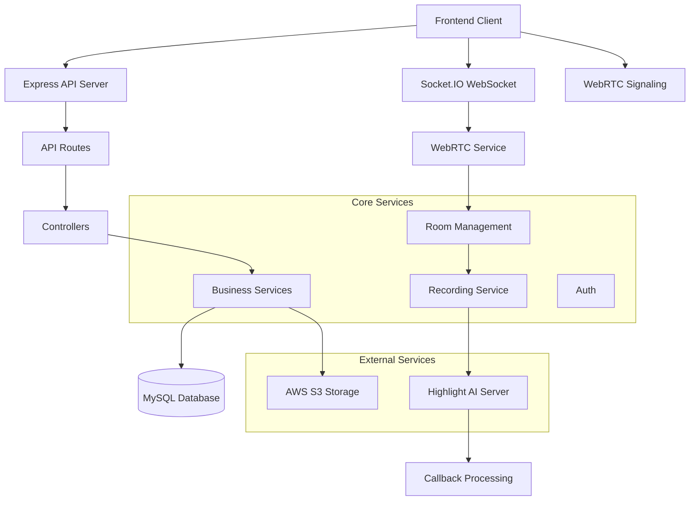

# 🎮 GameCast Server

---

## 🛠️ 기술 스택

### Backend Framework


### Database & ORM


### Real-time Communication


### Cloud & Storage


### Development Tools


---

## 🏗️ 서버 아키텍처



---

## � 프로젝트 구조

```
gamecast-server/
├── src/
│   ├── controllers/        # API 컨트롤러
│   ├── services/          # 비즈니스 로직
│   ├── routes/            # API 라우트
│   ├── middlewares/       # 미들웨어
│   ├── utils/             # 유틸리티
│   ├── types/             # TypeScript 타입
│   ├── validators/        # 입력 검증
│   └── index.ts          # 앱 진입점
├── prisma/               # 데이터베이스 스키마
│   ├── schema.prisma
│   └── migrations/
├── config/               # 환경 설정
├── docker/              # Docker 설정
├── nginx/               # Nginx 설정
└── docs/                # API 문서
```

---

## 🚀 빠른 시작

### 📋 사전 요구사항

- Node.js 18.0.0 이상
- MySQL 8.0 이상
- Docker & Docker Compose (선택사항)

### ⚡ 설치 및 실행

```bash
# 1. 저장소 클론
git clone https://github.com/UMC-GameCast/gamecast-server.git
cd gamecast-server

# 2. 의존성 설치
npm install

# 3. 환경 변수 설정
cp .env.example .env
# .env 파일을 열어 필요한 값들을 설정하세요

# 4. 데이터베이스 마이그레이션
npx prisma migrate dev

# 5. 개발 서버 시작
npm run dev
```

### 🐳 Docker로 실행

```bash
# Docker Compose로 전체 환경 실행
docker-compose up -d

# 로그 확인
docker-compose logs -f gamecast-server
```

---


## 🌐 브랜치 전략

본 프로젝트는 **Git Flow** 기반의 브랜치 전략을 사용합니다:

```
main (운영)
 ├── develop (개발 통합)
     ├── feature/user-auth (기능 개발)
     ├── feature/webrtc-streaming
     ├── feature/highlight-extraction
     └── refactor/clipCallback (리팩토링)
```

### 브랜치 유형

| 브랜치 | 용도 | 명명 규칙 |
|--------|------|-----------|
| `main` | 운영 배포용 안정 버전 | `main` |
| `develop` | 개발 통합 브랜치 | `develop` |
| `feature/*` | 새로운 기능 개발 | `feature/기능명` |
| `bugfix/*` | 버그 수정 | `bugfix/버그명` |
| `refactor/*` | 코드 리팩토링 | `refactor/리팩토링명` |

---


## 🔧 개발 환경 설정

### 스크립트 명령어

```bash
# 개발 서버 시작 (Hot Reload)
npm run dev

# 프로덕션 빌드
npm run build

# 프로덕션 서버 시작
npm start

# 테스트 실행
npm test

# 코드 린팅
npm run lint

# 코드 포맷팅
npm run format

# 데이터베이스 마이그레이션
npm run db:migrate

# Prisma Studio 실행
npm run db:studio
```

---

## � 성능 및 모니터링

### 로깅
- **Winston**: 구조화된 로그 관리
- **Morgan**: HTTP 요청 로깅
- **로그 레벨**: error, warn, info, debug

### 에러 처리
- 전역 에러 핸들러
- 커스텀 에러 클래스
- 상세한 에러 응답 형식

---

## � 보안

- CORS 설정
- Rate Limiting
- Input Validation (Joi)
- SQL Injection 방지 (Prisma ORM)

---


<div align="center">

**⭐ 이 프로젝트가 도움이 되셨다면 Star를 눌러주세요! ⭐**

Made with ❤️ by GameCast Team

</div>

